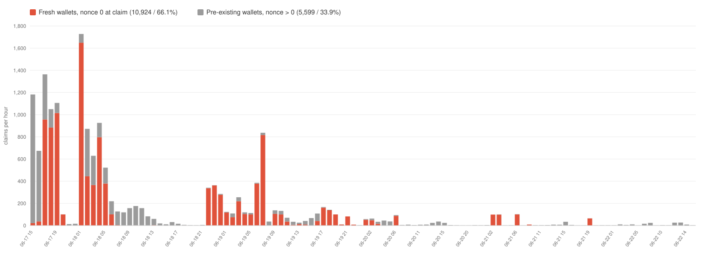

# o1.exchange ($O) Season-1 airdrop: on-chain analysis

A reproducible, on-chain-only review of the **o1.exchange $O Season-1 airdrop** on **Base (chain 8453)**.
Every figure here comes from public blockchain data and links to the exact wallets, blocks and transactions
behind it, so anyone can re-check it on a block explorer or re-run the scripts. The document states what the
data shows and, where relevant, what it does not prove.

> Snapshot: **2026-06-22** (latest claim 2026-06-22 15:04 UTC). The claim window opened 2026-06-17 15:26 UTC
> and was still open, so totals keep rising.
>
> The address-sorting, the equal-sum batches and the per-block timing are **permanent on-chain history**, they
> cannot be undone. The holding / inertia figures are a **point-in-time snapshot** and can change if wallets
> move later; any movement after this date happened after the analysis, not before it.

## The project

o1.exchange is a multi-chain DeFi trading terminal (spot, perps, prediction markets) live on Base, Solana and
BNB Chain. The `$O` token launched at TGE on 2026-06-17.

**Backers (public):** ~$4.9M raised from **Coinbase Ventures**, **Alliance**, **a16z**, The House Fund,
BloxRoute Labs, Amber, and 30+ institutional investors and angels.

**Scope:** this repo covers the Season-1 ("OG Trader") airdrop, the 30,000,000 $O (3% of supply) community
tranche distributed through the Merkle claim contract below.

## Contracts (open on Basescan)

| | address |
|---|---|
| `$O` token | [`0x182FA643...20b2`](https://basescan.org/address/0x182FA643E5f29d5EcA75e7b9CF9336A3fe4620b2) |
| Distributor (claim contract) | [`0x16557542...5631`](https://basescan.org/address/0x16557542aea17d4b2022d6c0a2e0e2fc0ce65631) |
| Merkle root (unchanged so far) | `0x8e3adf19...49cc` |

Data dictionary: [`data/`](data/). All headline numbers in one file: [`evidence/key_metrics.json`](evidence/key_metrics.json).

Terminology: a **fresh** wallet is one whose account nonce was 0 at the block it claimed, i.e. it had never
sent a transaction before receiving the airdrop. Everything else is labelled **non-fresh** (had prior
on-chain activity). "Non-fresh" is purely a neutral factual label and does not by itself imply a real user.

---

## Findings

### 1. Almost all of the airdrop went to wallets that had never been used before
Of 16,523 claims, **10,924 (66%) went to fresh wallets**. They received **26,033,902 $O, which is 95.68% of
everything distributed so far** (27.2M of the 30M Season-1 tranche has been claimed; the window is still open).

| cohort | wallets | $O received | share of $O |
|---|---:|---:|---:|
| fresh (never transacted before) | 10,924 | 26,033,902 | **95.68%** |
| non-fresh | 5,599 | 1,174,813 | 4.32% |

Every recipient and amount: [`data/all_recipients.csv`](data/all_recipients.csv) (16,523 rows).
Fresh wallets only: [`data/fresh_wallets.csv`](data/fresh_wallets.csv) (10,924 rows).

### 2. Those wallets do not move, they just hold (point-in-time, as of the 2026-06-22 snapshot)
- **10,863 of 10,924 still hold the full amount they received**, which is **99.96% of the $O untouched**.
- Only **61** of them have ever moved a single token.
- **10,885 (99.6%) are at nonce 1**: their only on-chain action ever is the one-time wallet-setup
  delegation. They have never sent a transaction themselves.

These are point-in-time balances (see the snapshot note above); the structural findings below are permanent.

### 3. The amounts are split very differently between the two groups
The value is not just concentrated, the shape of the two distributions is opposite:
- Fresh wallets cluster at four-figure amounts (median **1,564 $O**, mean **2,383 $O**).
- The non-fresh group is mostly dust: **1,777 of 5,599 (32%) received exactly 1 $O**, and 73% received 10 $O
  or less (median **2.78 $O**, mean **210 $O**). A small number of non-fresh wallets got large amounts (the
  top recipients, see finding 7).

So fresh wallets are 66% of recipients but took 95.68% of the tokens. Per-wallet amounts for both groups are
in [`data/all_recipients.csv`](data/all_recipients.csv).

### 4. Real wallets claimed first, the fresh wave came after
In the first ~2 hours after listing, claims are dominated by non-fresh wallets. Then the fresh wallets take
over and dominate most of the campaign that followed. Claims per hour, fresh (red) stacked under
pre-existing (gray):



Full hour-by-hour series: [`evidence/hourly_timeline.csv`](evidence/hourly_timeline.csv).

### 5. The fresh claims arrive in address-sorted batches of exactly 100
Sort the fresh claims by the order they happened on-chain and read the recipient addresses. An address is
just a number; for independent users the order would be random. Instead the addresses come out **strictly
sorted, in batches of exactly 100**, each batch resetting to a low address and climbing again.

- **21 batches of exactly 100**, each spanning 100 distinct blocks (one claim per block within the batch),
  and **never a run longer than 100** (a hard size cap).
- The batches do not tile the address space: every batch spans almost the whole range and **all 210 pairs of
  the 21 batches overlap**, so each is an independent full sweep, not the next contiguous slice of one list.
- Control: the same wallets in any address-independent order give a longest run of about 7; non-fresh
  claimers about 6. A run of 100 sorted addresses does not occur by chance, only from a pre-sorted list.

One real batch (first rows of 100, note the address climbing and the block changing each row):

| # | wallet | $O | block |
|---:|---|---:|---:|
| 1 | `0x00660e99...0c2f` | 1,884.83 | 47479105 |
| 2 | `0x0087f011...8ac8` | 119.29 | 47479107 |
| 3 | `0x02315d10...777a` | 2,338.14 | 47479108 |
| 4 | `0x04bc0e11...97a8` | 119.29 | 47479110 |
| 5 | `0x0892e3ab...d3b0` | 2,314.28 | 47479111 |
| ... | ... (94 more) | ... | ... |
| 100 | `0xfd59a0a7...46ef` | ... | 47479279 |

Full batch (all 100 wallets, blocks, times, tx hashes):
[`evidence/address_sorted_sweeps/example_batch_B01.csv`](evidence/address_sorted_sweeps/example_batch_B01.csv).
All 21 batches' wallets (2,100 rows):
[`evidence/address_sorted_sweeps/batch_wallets.csv`](evidence/address_sorted_sweeps/batch_wallets.csv).

### 6. Each batch of 100 is balanced to the same total, about 240,728 $O
Although individual amounts inside a batch swing widely (from under 50 to about 36,000 $O), **every batch of
100 sums to about 240,728 $O, within 0.6%.**

| batch | wallets | smallest | largest | batch total |
|---|---:|---:|---:|---:|
| B01 | 100 | 119 | 20,017 | 238,585 |
| B02 | 100 | 97 | 25,991 | 242,680 |
| B03 | 100 | 119 | 10,059 | 238,364 |
| ... | ... | ... | ... | ... |
| all 21 | | | | **240,728 avg, +/- 0.6%** |

Re-grouping the same amounts at random gives a ~14% spread, and **0 of 5,000 random groupings** are as even
as 0.6%. Address and amount are uncorrelated (r = 0.01), so the even totals are not a by-product of the
sorting. This is the signature of a deliberate equal-sum (budget-balanced) split. All 21 totals:
[`evidence/address_sorted_sweeps/batches_summary.csv`](evidence/address_sorted_sweeps/batches_summary.csv)
and [`evidence/address_sorted_sweeps/page_totals.csv`](evidence/address_sorted_sweeps/page_totals.csv).

### 7. The batch total is about 6x the largest single allocation
The largest single allocation anywhere is **41,500 $O**, reached by exactly **5 wallets** (all non-fresh, the
small set of top recipients). That is the largest amount observed, not a cap read from the contract. Inside
the batches the biggest is **36,100 $O**, well under it. Yet each batch of 100 aggregates **about 240,728 $O,
roughly 5.8x that single-wallet maximum**, spread across 100 wallets that each stay below it.

Amounts are fixed in the Merkle root the project published, so a claimer cannot choose their amount. So the
structure (sorted, equal-sum batches of 100, every member well under the largest single allocation) is a
property of **the allocation list itself**, not of how anyone claimed. What chain data cannot establish is
who controls the wallets or built the list (see [What the data does not show](#what-the-data-does-not-show)).

---

## What the data does not show

- It does not name who controls the fresh wallets. o1's in-app wallets have their keys generated and held by
  **Turnkey** (a wallet-infrastructure provider that keeps keys in hardware-isolated secure enclaves), and on
  Base each wallet is an EIP-7702 account delegated to a ZeroDev **Kernel** smart-account implementation
  (`0xd6CEDDe8...`), which is what enables the gasless claims. Because the wallets are created and operated
  through this stack and claim gaslessly, there is no funding transaction and no shared on-chain owner to
  trace (the common Kernel delegate is the wallet product's template, the same for every o1 user, not an
  owner). Clustering them to one named entity is not possible from chain data alone. The single-operator
  reading is a strong inference from converging structure (sorted plus equal-sum batches, uniform wallet
  type, uniform inactivity, value concentration), not a proof of identity.
- It does not reveal who owns the distributor. The contract is unverified with no public owner getter; its
  bytecode does expose `updateMerkleRoot`, `pause` and `withdraw` (standard distributor functions), so the
  published root is not strictly immutable, but the controlling address is not readable on-chain
  ([`evidence/distributor_functions.json`](evidence/distributor_functions.json)).
- The notable part is the composition of the allocation list and the batch structure, not any single
  mechanic in isolation.

Full limits: [`CAVEATS.md`](CAVEATS.md).

## Verify it yourself

- **One command:** run `node verify.js` from the repo root. It re-derives every headline figure and the
  nuances (run-length histogram, per-block stats, equal-sum spread, the 5,000-trial permutation, the largest
  allocation, the denominator) straight from the committed `data/` files and checks them against
  [`evidence/key_metrics.json`](evidence/key_metrics.json). No network, no dependencies.
- Open any wallet or transaction from the CSVs on [basescan.org](https://basescan.org). The claim history
  (the sorted order, blocks and amounts) is permanent; live balances reflect the chain *now* and may differ
  from the 2026-06-22 holding figures if wallets have since moved.
- The numbered scripts in [`scripts/`](scripts/) are the original chain-fetching pipeline (they need an RPC
  endpoint and expect the data files alongside them). Definitions and the exact ordering rule:
  [`METHODOLOGY.md`](METHODOLOGY.md).

## Layout
```
README.md      this summary
verify.js      one-command reproduction of every figure from data/
METHODOLOGY.md definitions, sources, reproduction, ordering rules
CAVEATS.md     what cannot be proven
data/          all recipients and all fresh wallets, plus raw inputs and a dictionary
evidence/      derived, fact-checkable tables (batches, timeline, distributor)
scripts/       the numbered chain-fetching pipeline that produced the data
```

---

Independent, on-chain-only analysis. Every figure reproduces from the committed data with `node verify.js`,
and the claim history is on [basescan.org](https://basescan.org). Author: [@votesa](https://x.com/votesa).
Licensed under [MIT](LICENSE).
